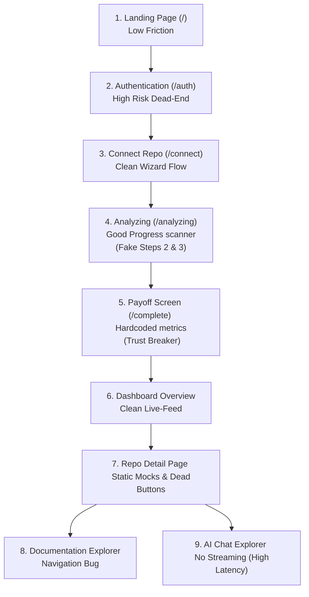

# AutoScribe-V2 UX/UI Design & Performance Audit

This report evaluates the **AutoScribe-V2** user experience (UX), frontend design, and perceived software performance from the first point of contact to the final workspace views. It identifies usability friction points, areas of cognitive stress, CTA mismatches, and gaps between visual feedback and system reality.

---

## 🗺️ The User Journey: Step-by-Step UX Audit

---

### Step 1: First Contact — Landing Page (`/`)
* **First Impression:** Clean, Vercel-like dark aesthetic. Minimalist header and clear value proposition.
* **Cognitive Stress:** Low. The path is narrow and clear: "Continue with GitHub."
* **UX Gaps:** 
  - If a session expires but local storage flags remain, the automatic redirect to `/dashboard` triggers an unhandled 401 error.

### Step 2: Authentication — Sign-in Screen (`/auth`)
* **Usability Analysis:** The split screen looks professional, showcasing a rolling feed of events to build excitement.
* **Cognitive Stress:** **Extremely High on the Email Path.** The "Email me a sign-in link" option is a complete dead-end. Clicking it triggers a faked timeout and pushes the user to `/connect` without a session cookie. The subsequent page loads empty lists and errors out silently in the console.
* **CTA Context:** The primary button ("Continue with GitHub") is clear, but the secondary email form is misleading.

### Step 3: Selection — Connecting a Repository (`/connect`)
* **Usability Analysis:** The multi-step wizard (`Account -> GitHub -> Select repo -> Analyze`) is excellent. It maps user progress and sets expectations.
* **UX Gaps:**
  - If the database query or connecting mutation fails, the submit button spins infinitely with no feedback or alert banner to indicate network errors.

### Step 4: The Wait — Repository Analysis (`/analyzing`)
* **Usability Analysis:** The scrolling scan log of files is a great micro-interaction. It reduces the perceived wait time by showing active progress.
* **Cognitive Stress:** **High expectations mismatch.** The copy claims *"This usually takes a few seconds."* In reality, because files are fetched sequentially and LLM processing takes time, it takes 30–60+ seconds.
* **UX Gaps:**
  - **The Step 2 & 3 Illusion:** The onboarding flow prompts the user to select multiple documents (API Reference, Runbooks, etc.) in Step 2, and then fakes writing them in Step 3. In reality, the backend only ever generates the `README.md`.

### Step 5: The Payoff — Analysis Completion (`/complete`)
* **Usability Analysis:** A celebratory checkmark and gauge chart showing an "AI Understanding Score" provides a sense of accomplishment.
* **Trust Breakdown:** **Severe.** The stats (2487 Files, 156 Modules, 32 Services, 92% Score) are completely hardcoded. If a developer connects a repository containing only 5 files, seeing "2487 files analyzed" immediately damages trust in the platform's honesty and intelligence.

### Step 6: Workspace — Dashboard Overview (`/_app/dashboard`)
* **Usability Analysis:** Clean metrics cards and a responsive activity log. The SSE integration pushes new log entries seamlessly, which makes the app feel "alive."
* **CTA Context:** Clear "Connect repository" and "Ask across repos" primary actions.

### Step 7: Central Hub — Repository Detail Page (`/_app/repository/$id`)
* **Usability Analysis:** The tabbed interface (`Overview`, `Architecture`, `Modules`, etc.) separates details well.
* **UX Gaps & Broken Elements:**
  - **Static Mock Leakage:** The Overview and Modules tabs ignore the repository ID and render static mock data. Every connected repository displays the exact same tech stack and modules list.
  - **Infinite Spinner on Disconnect:** Clicking "Disconnect repository" crashes the backend (due to foreign key integrity errors). Because the frontend has no mutation error handling, the user is left with a modal that refuses to close.
  - **Dead Buttons:** The "Re-analyze now" buttons and "Generate update" banner buttons are non-functional (no click handlers).
  - **In-Memory Settings:** The repository settings (auto-update toggle, branch targets) only modify React state and reset to defaults upon refreshing the page.

### Step 8: Content — Documentation Explorer (`/_app/documentation`)
* **Usability Analysis:** Side-by-side file tree explorer and markdown preview panels recreate a coding IDE atmosphere.
* **UX Gaps:**
  - **Explorer Navigation Bug:** Clicking any document in the navigation (e.g. "API Docs", "Environment Variables") updates the active tab name but *continues to render the README content*. It is impossible to view any documentation other than the README.

### Step 9: Communication — AI Chat (`/_app/ask`)
* **Usability Analysis:** Suggested questions are automatically derived from detected module names, which is a great touch.
* **Performance Stress:** **High Latency.** The interface waits for the entire LLM prompt, retrieved chunks, and response generation to resolve before displaying anything. The user sits looking at a static loader for 10-15 seconds.

---

## 📊 SaaS Best Practices Comparison & Recommendations

| Experience Area | Successful SaaS Patterns (Vercel, Notion, Netlify) | AutoScribe-V2 Current State | Actionable Recommendation |
| :--- | :--- | :--- | :--- |
| **Onboarding Trust** | Displays real, verified metrics immediately upon setup. | Shows hardcoded statistics (2,487 files) regardless of repo size. | Pass the `repoId` to the completion screen and query actual file/module counts. |
| **Response Latency** | Streams AI generation token-by-token (minimizes perceived wait). | Blocks UI until the entire LLM response is generated (15s delay). | Implement Server-Sent Events (SSE) streaming on the `/ask` route. |
| **Feature Completeness** | Clearly tags non-implemented features as "Beta" or "Coming Soon." | Fakes document choices (API Docs, Runbooks) that result in empty/broken views. | Disable unbuilt template options and add "Coming Soon" badges. |
| **Error Resiliency** | Displays error toasts, reset actions, and helpful debug hints. | Spares/locks buttons on errors; operations fail silently. | Add `onError` callbacks in TanStack mutations to show toast notifications. |
| **Data Consistency** | Persists user preferences and repo settings in the database. | Settings updates are lost on page refresh (in-memory React state). | Connect the settings tab to the existing `repo_settings` backend database table. |

---

## 🧠 Cognitive & Mental Stress Evaluation
1. **Perceived System Sluggishness:** The lack of streaming in the Ask tab increases the user's mental wait time. In conversational interfaces, a slow, non-streaming loader causes anxiety, leading users to believe the request has hung or crashed.
2. **Settings Amnesia:** When a user configures a repository's settings and returns later to find them reset, it creates confusion and erodes trust.
3. **Faked Interactive Interfaces:** The combination of selecting templates that never get generated, and clicking navigation items that render duplicate content, causes immediate user fatigue. The user is forced to double-check if they clicked the correct button.

---

## 🎯 High-Impact Visual & UX Upgrades
To elevate the AutoScribe-V2 experience to a premium SaaS standard, the following visual and UX improvements should be prioritized:

1. **Visual Cues for AI Generation (Markdown Preview):** 
   Add a subtle typing cursor animation and block-by-block fade-in effects on the documentation preview page as the document streams in.
2. **Enhanced Graph Interactivity:**
   Provide simple zoom/pan indicators and tooltips on the live architecture diagram to make navigation intuitive.
3. **Real-time Scan Metrics:**
   Update the progress scan page to display live counters of files found, scanned, and skipped, so the user knows the background worker is operating correctly.
